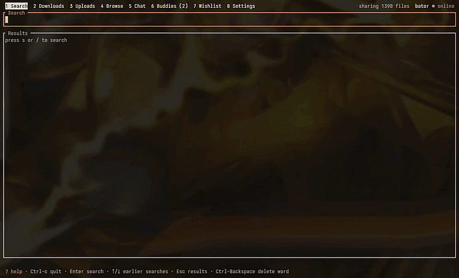

<div align="center">

# crabseek



**A fast, keyboard-driven [Soulseek](https://www.slsknet.org/) client for the terminal, written in Rust.**

[](https://github.com/aronkv/crabseek/actions/workflows/ci.yml)
[](https://codecov.io/gh/aronkv/crabseek)


</div>

crabseek speaks the Soulseek protocol natively. There is no daemon, web UI or Python runtime:
you type `crabseek`, search, and download whole albums in a few keystrokes.

## Features

- **Live search:** results stream in and are grouped by folder. Users with a free
  upload slot and fast connections come first, and the cursor stays on its row while
  new results arrive.
- **Format filter:** cycle between all formats, FLAC, lossless, MP3 320, MP3 and
  M4A/AAC with `f`. Folder downloads take only the matching audio files, plus the
  cover art and lyrics next to them.
- **Browse users:** `b` on any search result opens that user's whole share as the
  same folder tree, with the format filter and one-key downloads.
- **Buddies:** keep a list of users and see live whether they are online, away or
  offline, with their share size and speed. `A` on any search result, download or
  upload adds that user; `Enter` on a buddy browses their shares.
- **Private messages:** chat with other users on the Chat tab. `m` on any search
  result, download, upload or buddy writes to that user, and messages sent while you
  were offline arrive when you log in. The history is kept between runs.
- **Background mode (optional):** `q` closes the window but crabseek keeps sharing,
  downloading and searching; `crabseek` brings it back, like tmux. Off by default.
- **Desktop notifications (optional):** finished downloads (one notification
  per album), private messages and new wishlist results. Off by
  default; turn them on in Settings.
- **Built-in help:** `?` on any tab explains what it is for and lists its keys.
- **Wishlist:** saved searches keep running in the background, one every 12
  minutes as the server allows, and the Wishlist tab counts files you have not seen
  yet. `w` on a search's results adds it; `Enter` on a wish opens everything found.
- **One-key downloads:** `d` on a file or a whole folder. Interrupted downloads resume
  from where they stopped (`.part` files), and name clashes never overwrite anything,
  not even when two users share a file with the same name.
- **Transfer view:** live progress, speed, queue position and failure reasons, with
  retry and cancel. The download list survives restarts, and unfinished downloads
  continue where they stopped.
- **Sharing:** other users find your music folders (default `~/Music`) through
  network-wide searches, and can browse and download from them. crabseek joins the
  distributed search network on its own. Audio properties are read once and cached,
  and uploads are spread fairly over a configurable number of slots.
- **Quality at a glance:** kbps for every file and folder (estimated from size and
  length, marked `~`, when the peer does not send it), plus sample rate and bit depth
  for lossless files, duration and size.
- **Vim-style navigation:** `j`/`k`, `g`/`G`, `Ctrl-d`/`Ctrl-u` in every list, and
  `1`–`8` for the tabs. Text boxes edit like a shell: arrows, `Ctrl-Backspace` deletes a
  word, `↑`/`↓` recall earlier searches.
- **Automatic port forwarding:** UPnP opens the listen port on the router, with a
  warning when another NAT sits in front of it.
- **NAT traversal:** direct and firewall-piercing (indirect) peer connections are
  raced against each other, so peers behind NAT still work. Peers behind your own
  router are reached locally.
- **Scriptable CLI:** `crabseek search`, `crabseek download` and friends for quick checks
  and automation.

## Installation

### Quick install (x86_64 Linux)

```sh
curl -fsSL https://raw.githubusercontent.com/aronkv/crabseek/main/scripts/get.sh | sh
```

This downloads the latest prebuilt release, checks its SHA-256 sum and installs it to
`~/.local/bin` (glibc 2.35+, which covers current Arch, Fedora, Debian 12 and Ubuntu
22.04 and newer). Read the script first if you like:
[`scripts/get.sh`](scripts/get.sh). To remove crabseek again:
`curl -fsSL https://raw.githubusercontent.com/aronkv/crabseek/main/scripts/get.sh | sh -s -- --uninstall`.

### From source

You need a Rust toolchain (1.88 or newer). On Arch/CachyOS: `sudo pacman -S rustup && rustup default stable`.

```sh
git clone https://github.com/aronkv/crabseek.git
cd crabseek
scripts/install.sh          # builds and installs to ~/.local/bin/crabseek
```

Then run `crabseek`. If your shell cannot find it, add `~/.local/bin` to your `PATH`; the
script prints how. To install somewhere else, use `PREFIX=/usr/local sudo -E scripts/install.sh`.
Alternatively: `cargo install --git https://github.com/aronkv/crabseek crabseek`.

### Uninstall

```sh
cd crabseek
scripts/uninstall.sh        # asks once, then removes everything
scripts/uninstall.sh -y     # same, without the question
```

This removes crabseek completely:

| Removed | Path |
|---|---|
| the program | `~/.local/bin/crabseek` (or `$PREFIX/bin/crabseek`) |
| login and settings | `~/.config/crabseek/` |
| download list | `~/.local/share/crabseek/` |
| share cache | `~/.cache/crabseek/` |
| logs | `~/.local/state/crabseek/` |

Your downloaded music is never touched. The saved Soulseek password is deleted
too, and Soulseek has no password reset, so keep a note of it if you want to use the
account again. If you installed with `cargo install`, use `cargo uninstall crabseek` for
the binary and the script for the rest.

### AUR

The AUR package is ready ([`packaging/aur`](packaging/aur)) and goes up as soon as
AUR account registration reopens.

## First run

Start `crabseek`. There is nothing to set up by hand: the first time, it asks for a
Soulseek username and password, and it creates the config file itself once the server
accepts them. On later starts it logs in straight away. The login screen only comes
back if the saved password stops working.

- **Already have an account?** Log in with it.
- **New to Soulseek?** Pick any free name. The server creates the account the first
  time you log in with it, so double-check the spelling.

Your credentials are saved only after the server accepts them. See
[Security](#security) for where and how. To forget them, run `crabseek logout`.

### Background mode

Off by default: quitting stops sharing and downloads until the next start. Turn on
**Settings → Background mode**, and from the next start:

- `q` (or closing the terminal) only detaches: crabseek keeps sharing, downloading,
  running the wishlist and receiving messages.
- `crabseek` attaches again, right where you left off.
- `Q` inside, or `crabseek stop` from a shell, quits for good.

To start it at login as well, enable the systemd user service that the install script
puts in place: `systemctl --user enable --now crabseek`. While it runs in the background,
CLI commands that log in (`search`, `download`, ...) refuse to start, because a second
login would push the background one off the server.

### Let peers reach you

Soulseek is peer-to-peer. Downloads and sharing work best when other users can connect
to you on your listen port (TCP 2234 by default):

- **Router:** crabseek opens the port by itself with UPnP when the router supports
  it, and renews it every 30 minutes. The Settings tab shows the result; check it any
  time with `crabseek portmap`. Without UPnP, forward TCP 2234 to your computer by hand.
- **Double NAT:** if Settings says the router "sits behind another NAT", your ISP's
  modem is in front of it. That device needs a forward to your router, or has to run
  in bridge mode.
- **Local firewall:** allow the port, e.g. `sudo ufw allow 2234/tcp`.

Without this, you can still download from peers that are reachable themselves.

## Usage

| Where | Key | Action |
|---|---|---|
| everywhere | `s`, `/` | open the search box (crabseek starts in the results list) |
| | `?` | explain the current tab: what it is for, how it works, its keys (`j`/`k`, `PgUp`/`PgDn` scroll) |
| | `Alt-s` | toggle between the search box and the results, also while typing |
| | `1` to `8`, `Tab`, `F1` to `F8` | switch between Search, Downloads, Uploads, Browse, Chat, Buddies, Wishlist and Settings |
| | `m` | write a private message to the user of the selected row |
| | `A` | add the user of the selected result, download or upload as a buddy |
| | `q`, `Ctrl-c` | quit (`q` asks again while transfers are running) |
| every list | `j`/`k`, `↓`/`↑` | move |
| | `g`/`G`, `Home`/`End` | first or last row |
| | `PgUp`/`PgDn`, `Ctrl-d`/`Ctrl-u` | a page or half a page |
| text boxes | `←`/`→`, `Ctrl-←`/`Ctrl-→` | move by character or by word |
| | `Home`/`End`, `Ctrl-a`/`Ctrl-e` | start or end |
| | `Ctrl-Backspace`, `Alt-Backspace`, `Ctrl-w` | delete the word before the cursor |
| | `Ctrl-Delete`, `Alt-d` | delete the word after the cursor |
| | `Ctrl-u` / `Ctrl-k` | delete to the start or to the end |
| search box | `Enter` | search |
| | `↑`/`↓` | earlier searches |
| | `Esc`, `Alt-s` | back to the results |
| results | `Enter` | open or close a folder; on a file, download it |
| | `Space` | open or close a folder |
| | `l`/`h` | expand or collapse |
| | `d` | download the file or the whole folder |
| | `b` | browse all shares of that result's user |
| | `f` / `F` | next or previous format filter |
| browse | `b` | type another username (`Enter` loads it); the tab starts on the list |
| | same keys as results | open folders, filter, `d` download |
| downloads | `c` | cancel (the row stays, so `r` can retry it) |
| | `r` | retry a failed download, or ask again for a queued one's place |
| | `x` | remove the selected download, cancelling it if it runs |
| | `X` | clear all finished downloads |
| | `Enter`, `Space` | open or close a user or folder |
| | `l`/`h` | open or close; on a file, `h` closes its folder, then the user |
| | `f` | switch between grouped by user and folder (the default) and a flat list in queue order |
| uploads | `c` | cancel |
| | `x` | remove the selected upload, cancelling it if it runs |
| | `X` | clear all finished uploads |
| settings | `Enter` | edit the selected folder or port (`Tab` completes paths), toggle UPnP or notifications |
| | `a` / `x` | add or remove a shared folder |
| buddies | `a` | type a username to add (`Enter` adds it) |
| | `x` | remove the selected buddy |
| | `Enter`, `b` | browse the buddy's shares |
| chat | `Enter`, `i` | write to the selected conversation (`Enter` sends, `Esc` stops) |
| | `a` | start a conversation with a username |
| | `b` / `x` | browse the user / delete the conversation |
| | `PgUp` / `PgDn` | scroll through older messages, also while writing |
| wishlist | `a` | type a query to add (`Enter` adds it); `w` on search results does the same |
| | `Enter` | open everything found for the wish on the Search tab |
| | `r` | run the wish now (the next scheduled one waits a full interval) |
| | `x` | remove the wish |

### Command line

```sh
crabseek                                    # the TUI
crabseek search "artist album" --full-paths [--wishlist]
crabseek download <user> '<remote\path\to\file.flac>'
crabseek userinfo <user>                    # test a peer connection
crabseek browse <user>                      # list a user's shared folders
crabseek message <user> "text"              # send a private message, print replies
crabseek portmap                            # test automatic port forwarding (UPnP)
crabseek shares ["query"] [--dir PATH]      # what you share, and what a search would find
crabseek stop                               # quit crabseek running in the background
crabseek logout                             # forget saved credentials
crabseek config-path                        # where the config lives
```

## Configuration

The download folder, the listen port and the shared folders can be changed in the
**Settings** tab (`8`); changes apply and are saved immediately. Everything lives in
`~/.config/crabseek/config.toml`, and every key except the credentials is optional:

```toml
username = "..."                        # written by the login screen
password = "..."
download_dir = "~/Downloads/crabseek"   # default
shared_dirs = ["~/Music"]               # default
upload_slots = 2                        # default
listen_port = 2234                      # default
upnp = true                             # default: open the port on the router
notifications = false                   # default: no desktop notifications
background = false                      # default: q quits instead of detaching
server = "server.slsknet.org:2242"      # default
```

| File | Contents |
|---|---|
| `~/.config/crabseek/config.toml` | login and settings |
| `~/.local/share/crabseek/downloads.json` | the download list |
| `~/.local/share/crabseek/buddies.json` | the buddy list |
| `~/.local/share/crabseek/wishlist.json` | wishlist queries |
| `~/.local/share/crabseek/chats.json` | private message history (mode 600) |
| `~/.cache/crabseek/shares.json` | cached audio properties of shared files |
| `~/.local/state/crabseek/crabseek.log` | log of the last TUI session (`RUST_LOG=debug` for more) |

## Security

- The Soulseek login needs the plain password, so clients have to keep it. Nicotine+
  and slskd keep it unencrypted in their config files, and crabseek does the same, with
  tighter permissions: `~/.config/crabseek/config.toml` is written with mode `600`,
  inside a `700` directory, so only your user can read it. The file is replaced
  atomically.
- Encrypting the file would not add real protection, because the key would have to sit
  on the same disk. System keyring support (Secret Service) may come as an option.
- Credentials never appear in logs, and the config lives outside the source tree, so
  it cannot end up in a commit of this repository.
- If you keep `~/.config` in a dotfiles repository, make sure `crabseek/` is not
  committed.

## Roadmap

- [x] Login, peer connections (direct and indirect), search, downloads with resume
- [x] TUI with folder view, format filter and transfer list
- [x] Sharing your music library and serving uploads
- [x] Distributed search network (as a child node; relaying searches to children is next)
- [x] Browsing a user's shares
- [x] Wishlist
- [x] Private messages
- [x] Automatic port mapping (UPnP)
- [ ] AUR package

## Development

```sh
cargo test                                   # unit and loopback-network tests
cargo clippy --all-targets -- -D warnings
scripts/fetch-protocol-doc.sh                # local copy of the protocol docs
```

The workspace has three crates:

| Crate | Purpose |
|---|---|
| `crates/proto` | Soulseek message encoding and decoding, without I/O. Byte-for-byte tests against the spec. |
| `crates/net` | tokio networking: server session, peer connections, searches, transfers, and an actor that ties them together. |
| `crates/crabseek` | The binary: ratatui TUI and CLI. |

## Acknowledgements

- The [Nicotine+ protocol documentation](https://nicotine-plus.org/doc/SLSKPROTOCOL.html),
  the reference used to implement the protocol.
- [soulseek-rs](https://github.com/michel/soulseek-rs), another Rust client, consulted
  for comparison. crabseek's code is written from scratch.

## License

[MIT](LICENSE). Please share back what you download, and respect copyright where you live.
